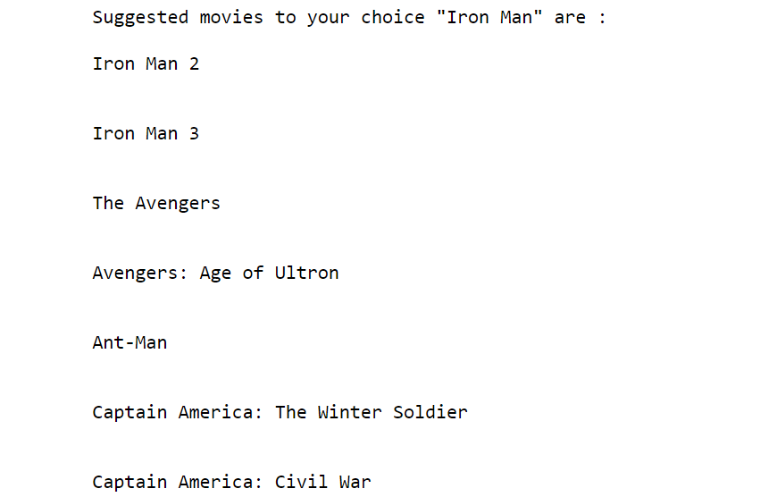

# Movies_Recommendation_System

* This is a simple content based movie-recommendation system.
* It helps user to get movies similar to a movie that he/she had watched.
* A little data preprocessing and feature selection is done.
* Dataset consists of little less than 5000 movies.

## Output format is as follows : 

